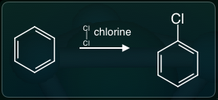
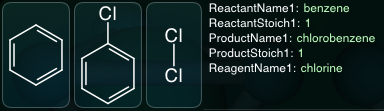
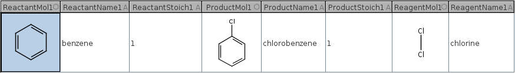
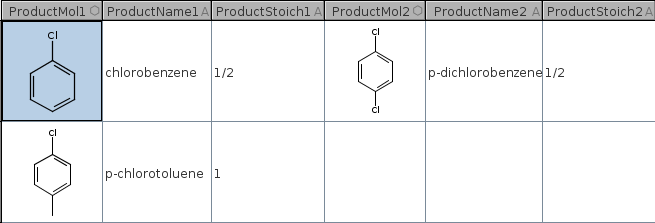
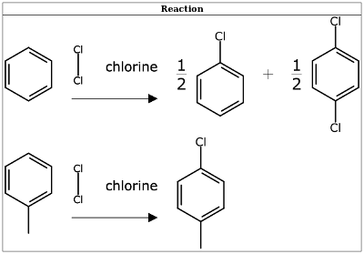

# DataSheet Aspects

An *Aspect* is a datasheet extension that follows a certain convention, which defines higher order behaviour. The XML datasheet format was developed for the SketchEl open source project, which is hosted on [SourceForge](http://sketchel.sf.net/). It is used by software by [Molecular Materials Informatics](http://molmatinf.com) for representing any kind of collection of chemical structures and other data. 

An aspect is a convention for extending the core datasheet format in order to provide higher order markup, so an application that recognises the aspect can represent the data in a more structured way.

For example, several iOS apps, including the Mobile Molecular DataSheet, provide functionality for viewing, editing and manipulating reactions. A reaction is not represented as a discrete datatype, but rather it is composed of a group of columns within a datasheet, and metadata extensions, which define the way that the components make up reactants, products and reagents, which have structures, names and stoichiometry data.

The aspect defines itself in an entry in the Extensions part of the datasheet header. With the reaction aspect, a datasheet is represented in its full glory:



Without the aspect, it is rendered as its constituent pieces, which are made up of the basic datasheet data types:



Aspects are a style of convention for using metadata to signal to interpreting software that the contents of a datasheet may optionally be understood within a higher context. In the case of reactions, software that understand the reaction aspect are capable of arranging certain molecule and string data into a chemical reaction. Because of the way the underlying datasheet format is designed, it is safe to open, view, modify and save a datsheet without having an understanding of the aspect metadata.

# Syntax

An aspect registers itself by adding an entry to the Extensions part of the DataSheet XML header:

```
<Extension>
...
<Ext type="org.mmi.aspect.{name}" name="{description}"><![CDATA[...]]></Ext>
...
</Extension>
```

The aspect is identified by the value of the type attribute, which uses a Javaesque package-class identifier style. The name attribute is arbitrary, and does not affect the functioning of the aspect. The contents of the `<Ext>` tag contain any datasheet-specific information that the aspect needs to store, in order to make sense of the information that it encodes within the datasheet.

Often the aspect data will include information that specifies which columns are used by the aspect, if there is some variation. For example, when storing reactions in a datasheet, some of the columns are explicitly used for storing reaction information, but there may also be additional columns that are not within the aspect's domain. The data stored within the extension provides enough information for the aspect implementation to determine this.

Whenever the datasheet is modified by an implementation of an aspect, the metadata may be updated, and the columns that the aspect requires may change also. Because it is valid to edit a datasheet without knowledge of the domain of any of the aspects, it is essential for aspects to be implemented in a fault-tolerant way. For example, an aspect will always be able to recover from renaming or deleting columns or metadata that is essential to its operation. The worst case scenario is that the aspect will have to reinvent blank data in order to compensate.

# Aspects

Several of the *Aspects* currently in use are described below

## ReactionSheet

A reaction-enhanced datasheet claims several columns for use in describing the reactants, products and reagents that make up the reaction definitions. The metadata that the aspect needs to store within the datasheet header consists of the total counts for each of these, e.g.

```
<Ext type="org.mmi.aspect.Reaction" name="Reaction"><![CDATA[nreactants=1
nproducts=1
nreagents=1
]]></Ext>
```

The aspect implementation can deduce from this heading that the following columns are used to describe reactions:



* ReactantMol1 (molecule)
* ReactantName1 (string)
* ReactantStoich1 (string)
* ProductMol1 (molecule)
* ProductName1 (string)
* ProductStoich1 (string)
* ReagentMol1 (molecule)
* ReagentName1 (string)

The basic format is straightforward: `{component}{type}{index}`, where reactants and products claim 3 columns each (Mol, Name and Stoich), while reagents have just the first two. The molecule columns store the structures, and the name columns store the names. Either or both of these may be defined. If both the molecule and name values are null, then the component is considered to be blank.

Stoichiometry values are stored as formatted strings. Any non-negative numeric value is valid, as is a ratio, e.g. "1/3". Null values imply the default stoichiometry, which is "1". A value of "0" is taken to mean that the component is not stoichiometric.

A reaction datasheet can have any number of rows, and each row represents one reaction. Because these reactions do not necessarily have the same number of components, the component counts defined in the metadata actually indicate the maximum number of components. For example, if there are 2 rows/reactions, and the first reaction has 2 products, while the second reaction has just one, the aspect definition will contain the line `nproducts=2`, but the second reaction leaves the second product blank, e.g.



The aspect implementation considers the second reaction to have just one product:



# YieldSheet

The `org.mmi.aspect.Yield` aspect is used to supplement a reaction scheme with its own data. The aspect implementation requires that the `org.mmi.aspect.Reaction` aspect is also present. The metadata for a datasheet might look like:

```
<Extension>
<Ext type="org.mmi.aspect.Reaction" name="Reaction"><![CDATA[nreactants=2
nproducts=1
nreagents=0
]]></Ext>
<Ext type="org.mmi.aspect.Yield" name="Reaction"><![CDATA[nreactants=2
nproducts=1
nreagents=0
]]></Ext>
```

The aspect claims a number of additional columns for each reactant and product (but not reagents, which do not feature in the yield scheme, because they are not stoichiometric). The nomenclature follows the same pattern as the columns used for reactions, e.g.:

* ReactantMass1 (real, g)
* ReactantVolume1 (real, mL)
* ReactantMoles1 (real, mol)
* ReactantDensity1 (real, g/mL)
* ReactantConc1 (real, mol/L)
* ReactantPrimary1 (boolean)
* ProductMass1 (real, g)
* ProductVolume1 (real, mL)
* ProductMoles1 (real, mol)
* ProductDensity1 (real, g/mL)
* ProductConc1 (real, mol/L)
* ProductYield1 (real, %)

The numeric values are stored as standardised units, which are indicated above. Values are only stored within the datasheet if they have been explicitly provided by the user. Inferred values are calculated as needed.

# SARSheet

The `org.mmi.aspect.SARTable` aspect adds scaffolding interpretation details to the datasheet. The tabular layout of a SAR table datasheet is already quite similar to the core datasheet functionality. The aspect defines some number of fields, each of which corresponds to one-or-more columns, and serves to define the specific meaning of the column or group of columns.

The fields are listed in the extension, one per line, using the pattern field={type},{name}. For example:

```
<Extension>
<Ext type="org.mmi.aspect.SARTable" name="SARTable"><![CDATA[field=scaffold,Scaffold
field=substituent,R1
field=substituent,R2
field=construct,Molecule
field=ID,id
field=text,Description
field=property,Ki
]]></Ext>
</Extension>
```

There must always be exactly one field of type scaffold and one of type construct. All other field types can be present in any number. The field names are used to derive the corresponding columns in datasheet:

* *scaffold*: '{name}' (molecule)
* *substituent*: '{name}' (molecule)
* *construct*: '{name}' (molecule), '{name}_locked' (boolean)
* *ID*: '{name}' (string)
* *text*: '{name}' (string)
* *property*: '{name}' (real), '{name}_units' (string), '{name}_mod' (string)

Four of the six field types map directly to a single column, which has the same name as the field. The construct type requires an auxiliary flag to define whether the constructed molecule is "locked", which prevents it from being automatically recreated. The property type needs to split its data into three parts: the numeric value, which corresponds to a column with the same name as the field, and two columns for units and modifiers. The modifier for a property is a freeform auxiliary which further qualifies or substitutes for the value (e.g. ">", "+/- 10", "n/a", "5.5-5.2", etc.).