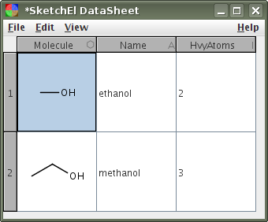

# XML DataSheet Format

The XML datasheet format was developed for the SketchEl open source project, which is hosted on [SourceForge](http://sketchel.sf.net/). It is used by software by [Molecular Materials Informatics](http://molmatinf.com) for representing any kind of collection of chemical structures and other data. Constituent molecules are encoded with the [SketchEl Molecule](../sketchel/README.md) format.

The format is essentially a representation of a structured table, where each column has a particular type, and each row contains one cell for every column. There is a special header section which stores metadata which applies to the whole datasheet.

The XML datasheet format is often used interchangeably with the industry standard MDL SD file format, but there are some important caveats to be aware of. The MDL SD file format can only include one molecule per entry, while the XML datasheet format can have any number of columns which are typed as molecules. SD files also have no way of specifying field types, and do not enforce a table structure throughout the file. Software which expects the contents of an SD file to conform to a typed table format, which is usually a valid assumption, are required to scan the entire SD file to ascertain the fields and make guesses as to their data type. There is also no approved method for storing meta information in an SD file, such as document title, or other information about the meaning of individual fields.

The preferred file extension is `.ds`, and the MIME type is `chemical/x-datasheet`.

# Example

A very simple datasheet is shown below, rendered using the [SketchEl](http://sketchel.sf.net/) datasheet editor, along with the XML source for the file:



```
<?xml version="1.0" encoding="UTF-8"?>
<DataSheet>
    <Summary>
        <Title>Small Molecules</Title>
        <Description><![CDATA[Several structures of small molecules]]></Description>
    </Summary>
    <Extension/>
    <Header nrows="2" ncols="3">
        <Column id="1" name="Molecule" type="molecule">Molecular structure</Column>
        <Column id="2" name="Name" type="string">Common name</Column>
        <Column id="3" name="HvyAtoms" type="integer">Number of heavy atoms</Column>
    </Header>
    <Content>
        <Row id="1">
            <Cell id="1"><![CDATA[SketchEl!(2,1)
C=-6.0500,3.4000;0,0,i3
O=-4.5500,3.4000;0,0,i1
1-2=1,0
!End]]></Cell>
            <Cell id="2"><![CDATA[ethanol]]></Cell>
            <Cell id="3">2</Cell>
        </Row>
        <Row id="2">
            <Cell id="1"><![CDATA[SketchEl!(3,2)
C=-5.1000,2.8000;0,0,i3
C=-3.8010,3.5500;0,0,i2
O=-2.5019,2.8000;0,0,i1
1-2=1,0
2-3=1,0
!End]]></Cell>
            <Cell id="2"><![CDATA[methanol]]></Cell>
            <Cell id="3">3</Cell>
        </Row>
    </Content>
</DataSheet>
```

# Specification

The basic prototype for an XML datasheet is as follows:

```
<?xml version="1.0" encoding="UTF-8"?>
<DataSheet>
    <Summary>
        <Title>{title}</Title>
        <Description><![CDATA[{description}]]></Description>
    </Summary>

    <Extension>
        <Ext name="{name1}" type="{type1}" ><![CDATA[{extension1}]]></Ext>
        <Ext name="{name2}" type="{type2}" ><![CDATA[{extension2}]]></Ext>
        ...
        <Ext name="{nameN}" type="{typeN}" ><![CDATA[{extensionN}]]></Ext>
    </Extension>

    <Header nrows="{#rows}" ncols="{#cols}">
        <Column id="1" name="{name1}" type="{type1}" >{description1}</Column>
        <Column id="2" name="{name2}" type="{type2}" >{description2}</Column>
        ...
        <Column id="N" name="{nameN}" type="{typeN}" >{descriptionN}</Column>
    </Header>

    <Content>
        <Row id="1">
            <Cell id="1">{data}</Cell>
            <Cell id="2">{data}</Cell>
            ...
            <Cell id="N">{data}</Cell>
        </Row>
        <Row id="2">
            <Cell id="1">{data}</Cell>
            <Cell id="2">{data}</Cell>
            ...
            <Cell id="N">{data}</Cell>
        </Row>
        ...
        <Row id="N">
            <Cell id="1">{data}</Cell>
            <Cell id="2">{data}</Cell>
            ...
            <Cell id="N">{data}</Cell>
        </Row>
    </Content>
</DataSheet>
```

The three header elements, `<Summary>`, `<Extension>` and `<Header>` must be listed in the XML document before the `<Content>` element. This is required in order to make it possible and convenient to use the datasheet format for streaming purposes, e.g. using a streaming XML parser such as SAX/StAX. The layout of the datasheet is defined prior to the arrival of the data.

# Summary

The `<Summary>` section contains two elements: `<Title>` and `<Description>`. The datasheet title should be contained on a single line, while the description can be multiline text, so is enclosed within a CDataSection.

# Extension

The `<Extension>` section is optional. It is a way for programs to store metadata within a datasheet. Whenever a datasheet is manipulated, the software should generally leave alone any of the extensions that it does not recognise.

Each extension is encoded within a child element named `<Ext>`. The name and type attributes are arbitrary, and should be distinguishable by software which understands their nature. The content is a CDataSection which contains arbitrary data.

The extension fields are discussed in more detail the [Aspect](../aspect/README.md) documentation.

# Header

The `<Header>` section defines the size of the table that makes up the content of the datasheet, as well as the properties of each of the columns. The `nrows` and `ncols` attributes must exactly specify the dimensions. Note that the `nrows` attribute is actually optional: if it is omitted, it means that the number of rows is unconstrained, as it was not known when the serialisation process began.

For every column, there must be a single `<Column>` child element. The `id` attribute identifies which column it refers to. Numbers must be between 1 and the number of columns. The type attribute specifies what kind of data the column holds, while the description attribute is an arbitrary single-line summary describing the column.

The available column types are:

* `molecule`: Each cell should be either blank (null) or contain a molecular structure, expressed using the [SketchEl molecule format](../sketchel/README.md). The content should be wrapped up in a CDataSection. It is reasonable to expect that when the datasheet is viewed, the molecules will be interpreted and drawn as chemical structures.
string: Cells can contain an arbitrary single-line string. Except for newlines, whitespace is permitted and should be preserved by wrapping the content in a CDataSection.

* `integer`: Cells should contain an integer number value, or be blank, which is equivalent to null. Integers should be within the range of a 32-bit signed integer.

* `real`: Cells should contain a real floating point number, using either decimal or scientific notation, or be blank, which is equivalent to null. Real values should be expected to be processed using double precision floating point arithmetic.

* `boolean`: Cells should have one of three values: "true", "false" or blank (null), which gives them 3 possible states.

* `extend`: Cells contain arbitrary text data, which should be wrapped up in a CDataSection. The content of these cells should be considered as metadata. For a default viewer or editor, the data contained within these columns should be ignored unless explicitly recognised.

Note that for most of these types, the value of an individual cell must either conform to the format of the data type, or be blank, which is considered to be a special null state. The exceptions are the string and extend types, for which an empty string is valid, and so there is no null state.

# Content

The `<Content>` section is split into individual `<Row>` elements, each of which is split into individual `<Cell>` elements.

The number of rows is defined in the header, and there must be a row element for each and every one of them. Furthermore, the rows must be in consecutive order. The `id` attribute specifies the row number, for the sake of consistency checking. If the row identifiers do not start at 1 and increase until reaching the limit, the datasheet is considered to be malformed. The requirement for consecutively numbered rows makes it possible to use the datasheet format for streaming purposes.

Note that omitting the `nrows` attribute in the `<Header>` section is permitted: this is often necessary when creating a datasheet from a stream, whereby the final row count is not known. If the attribute is missing, the datasheet should be parsed, and the maximum number of rows is not constrained.

Each row must contain exactly one cell for every column that is defined in the header. The id attribute specifies the column number, and it must be between 1 and the number of columns defined in the header. Unlike for rows, the cells are not required to be arranged consecutively, but all must be present and unique. Cells whose data is null must still be defined by an element.