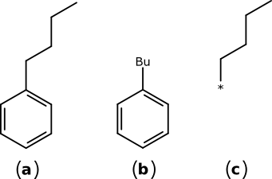
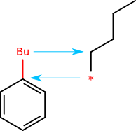
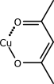
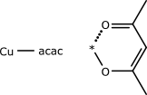
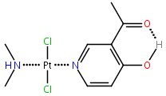

# SketchEl Molecule Format

The SketchEl molecule format was developed for the SketchEl open source project, which is hosted on [SourceForge](http://sketchel.sf.net/). It is used by all software by [Molecular Materials Informatics](http://molmatinf.com) for storing 2D molecular structures. 

The format is largely equivalent to the basic properties of an MDL MOL file. A large proportion of ordinary molecules can be converted between SketchEl and MDL MOL formats without information loss, but it should be noted that there are some differences which are crucial for certain types of molecules. In particular, the SketchEl molecule format provides additional information for describing implicit hydrogens and has more available bond orders, which are vital for describing molecular structures that do not follow the Lewis octet rule. The MDL MOL format has a very long list of properties which are not usually used for describing individual small molecules, e.g. query features, stereochemical mixtures, polymer units, etc., none of which are explicitly supported by the SketchEl format.

The only features included in the SketchEl format are those which have cheminformatic meaning. The SketchEl format is not intended to be used to describe a drawing, but rather it describes a molecular species with enough detail to ascertain its chemical composition and enough information to produce a drawing from it. This distinction is important, because it means that the format has no properties for encoding drawing style (e.g. font size, line width, colour, double bond positioning, etc.), and it has no fields for additional decorations (e.g. text labels, reaction arrows, molecular orbital lobes). All of these additional properties and decorations can be accomplished in other ways, but they are not a part of the core molecule format.

Because the format is minimalistic, and all of the features have a well defined meaning, it is straightforward to interpret a SketchEl molecule in its raw form. Additional properties about the molecular structure need to be calculated after the fact (e.g. aromaticity, stereochemical parity), or stored in an ancilliary field within a datasheet, or they can be encoded as arbitrary data within the atom or bond extension fields, and interpreted as and when necessary.

# Specification

* The preferred file extension is `.el`, and the MIME type is `chemical/x-sketchel`.

* The format is strictly 7-bit ASCII.

*  UNIX-style line separation should be used by default, i.e. "\n", but MSDOS-style ("\r\n") should always be accepted when encountered.

*  Whitespace padding should never be used.

*  With the exception of separators, all characters which are not pure ASCII, or are control codes (in the range 0 .. 31), or are one of the following forbidden characters: space (` `), backslash (`\\`), comma (`,`) semicolon (`;`) or equals (`=`), must be replaced with an escape code.

* The escape code syntax is: `\hhhh`, where the four digits following the backslash are hexadecimal encoding for a 2-byte unicode character. Thus, some of the otherwise unavailable characters are encoded as:

```
\0020  space
\005C  \
\002C  ,
\003B  ;
\000A  newline
```

* Integers are encoded in plain denary, while floating point numbers are encoded using English-style decimal, using the period separator for the fractional part. Scientific notation is not used.

* There is no limit to line length. Readers should not use a fixed line size.

* The first 9 bytes of the format must correspond to the ASCII "`SketchEl!`" (hex: 53 6b 65 74 63 68 45 6c 21), which is the recognition string.

# Outline

A SketchEl character stream is described by the following pattern:

```
SketchEl!({#atoms},{#bonds})
{element}={x},{y};{charge},{unpaired}[,i{implicit}][,e{explicit}][,n{mapnum}][,...]
...
{from}-{to}={order},{type}[,...]
...
!End
```

* On the first line, {#atoms} and {#bonds} are given. The total number of lines between the `SketchEl!` and `!End` tags must be equal to the sum of these values.

* The `{element}` field is used to provide a symbol for each atom. It may correspond to an atom in the periodic table, or it may contain any alternate text, as long as forbidden characters are properly escaped out. There is no mandated maximum length. For purposes of interpretation, if the element is not a part of the periodic table, it should be treated as a placeholder, with a molecular weight of 0.

* The coordinates for the atom are given first, then the remaining properties follow, separated by a semicolon. Note that the boundary between coordinates and other properties uses a different separator, in order to reserve the right to supplement the `{x}` and `{y}` coordinates with `{z}`, at a later date. Readers of the format should not refuse to read the input if a third coordinate is included, though they are not at this point required to carry the value along with the datastructure.

* Following the coordinates, the `{charge}` and `{unpaired}` fields are mandatory. Both are integers, and are most commonly zero.

* `{charge}` is the whole ionic charge associated with the atom. Partial charges are not allowed.

* `{unpaired}` - the number of unpaired electrons - is usually used to denote radicals. For first row organic atoms, a value of 1 means that the atom is a radical, and has one less implicit hydrogen than might otherwise be expected, e.g. methyl radical with three singly bonded substituents. Beyond monoradical organic elements, this field should be used as a somewhat subjective hint regarding spin state.

* Any number of data entries can follow on an atom line, but each of them must begin with a single character prefix, which describes what type of data follows, i.e. the whole field is appended to the line as: `,{id}{content}`. If the content contains forbidden characters, they must be escaped out. Values of `{id}` are all reserved for official fields to be added at a later date. The currently available values are:

 * `i`: the calculated implicit hydrogen count. When encountered, it means that the implicit hydrogen count is unconstrained, and that the number of implicit hydrogen atoms should be recalculated every time its state changes. For example, a methyl substituent has 3 implicit hydrogens, but if it is singly bonded to another carbon, the sketcher application should decrement this number, for convenience. The normal field value for methyl would be i3, which shows the most recently calculated number of implicit hydrogens. The number is included, so that reader applications are not forced to derive their own implicit hydrogen counting algorithm, and can merely read out the correct value.

 * `e`: the explicit hydrogen count, which supercedes the implicit count. The presence of this field means that the user has specified the exact number of additional hydrogens which reside on the atom, and that this number is not open for interpretation, even if the environment of the atom changes.

 * `n`: the mapping index number, which is an arbitrary integer, which has an implied value of 0 if absent. Referring selected atoms to some alternate numbering scheme, for external purposes, is commonly useful.

 * `m`: the isotope mass, which is an integer that should correspond to the integer mass of the singular nucleus type, e.g. 2 for deuterium, 13 for carbon-13, etc. The default value, 0, means that the atoms are statistically distributed according to natural abundance.

 * `x`: invariant expansion field. The value of the content should be ignored, unless the application recognises header codes that it understands. There is no specific convention for embedding atom-specific data, but it is prudent to include the name of the application responsible for the extra field, e.g. `x$SOMEPROGRAM$SUBSTITUENT#1234`. An application which reads a SketchEl file should retain all of these expansion fields, associated with the original atoms, unless the atom is actually deleted. This expansion field is used for data which is not dependent on the entire molecule.

 * `y`: dependent expansion field. As for x, except that the properties of this field are tied to the whole molecule. If the reader program does not recognise the expansion field, and the data is modified, then this property must be invalidated. For example, storing calculated partial charge might be done with `y$TOPOLOGICAL$PARTIAL_CHARGE=0.3327`. If the structure is modified, then the field is no longer valid, and so it must be deleted.

 * All other single-character field prefixes are reserved for future use. Unrecognised expansion fields should be treated in the same way as x, i.e. the value should be preserved, unless the atom is deleted.

 * It is valid to use these fields more than once in order to encode multiple properties, e.g. `xTHING1,xTHING2`. In cases where a field value is understood to have a meaning that overrides a previous field, the latest value should be used.

* Bonds are described by four integer values, in edge-list format, followed by an arbitrary number of expansion fields. Bonds must not be redundant, i.e. no two bonds may have the same connection points.

* Bond `{from}` and `{to}` must have values which are between 1 and the number of atoms.

* Bond `{order}` is an integer between 0 and 4.

* Bond `{type}` is a number, for which values between 0 and 3 are currently defined. Unrecognised bond types may be retained or converted to 0, at the discretion of the application. 0 encodes a "normal" bond, with no special properties. 1 encodes "inclined" (or "up-wedge"), where the destination atom is considered to be higher than the source atom relative to the plane of the page (or "Z-axis"), while 2 encodes "declined" (or "down-wedge"), where the destination atom is lower than the source atom. A value of 3 is the unknown stereochemistry type, drawn as a "squiggly" line, which implies that the atoms on either end have undefined stereochemistry, which may encode for a mixture, or undefined.

* Normal bond types are directionless, so \[from,to] is the same as \[to,from]. Inclined or declined bonds, however, must be ordered such that the first atom is the source, which is usually rendered as the thin end of the "wedge". The direction of the wedge has important implications for encoding of stereochemistry.

* Custom data entries for bonds have the same form as for atoms: `,{id}{content}`, where `{id}` should be `x` for invariant fields, and `y` for those which should be removed whenever the molecule is modified.

A very simple example - ethanol with implicit hydrogens - is as follows:


```
SketchEl!(3,2)
C=-6.9500,6.5500;0,0,i3
C=-5.6510,7.3000;0,0,i2
O=-4.3519,6.5500;0,0,i1
1-2=1,0
2-3=1,0
!End
```

A second example, based on the same heavy-atom ethanol structure, is an example of how to not to make a cheminformatically meaningful structure, but nonetheless demonstrates some features of the format:


```
SketchEl!(3,2)
C=-6.4000,2.3500;1,0,i2,xPERM1,yTEMP1
C=-5.1010,3.1000;0,0,e2,xPERM2,yTEMP2
\004F=-3.8019,2.3500;0,1,i0,xPERM3,yTEMP3
2-1=1,1,xPERM12,yTEMP12
2-3=1,2,xPERM23,yTEMP23
!End
```

# Abbreviations

Inline atom abbreviations are an extension to the core format, which allow atoms to be labelled with abbreviation codes, e.g. Et, tBu, Ph, etc., and retain embedded versions of the abbreviated structure fragment. Because each abbreviation retains its structural content within the description of the molecule, it is still possible to derive the molecular formula correctly without having to resort to an external lookup table. Also, abbreviations can be defined for custom purposes and do not need to be standardised. It is straightforward to expand out abbreviations to obtain a fully atom-specified structure. The structures of inline abbreviations may contain their own inline abbreviations, which are encoded recursively.

Software that is capable of reading and writing the core SketchEl format will gracefully ignore abbreviations: the abbreviation labels will be displayed, but their meaning will be unknown. Modifying atoms that do not contain abbreviations is defined to be safe through multiple read/write cycles, which provides a measure of forward compatibility.

Consider the following example of butylbenzene:



Structure (a) shows the all heavy atom structure, while structure (b) shows the representation which uses Bu to represent the butyl substituent, and (c) shows the definition of the abbreviation.

The SketchEl format representation of (b) is encoded as follows:

```
SketchEl!(7,7)
C=6.1000,0.2500;0,0,i0
C=4.8010,-0.5000;0,0,i1
C=7.3990,-0.5000;0,0,i1
C=4.8010,-2.0000;0,0,i1
C=6.1000,-2.7500;0,0,i1
C=7.3990,-2.0000;0,0,i1
Bu=6.1000,1.7500;0,0,i0,aSketchEl!(5\002C4)\000A*\003D6.1000\002C0.2500\003B0\002C0\002Ci0\000AC\003D6.1000\002C1.7500
                            \003B0\002C0\002Ci2\000AC\003D7.3990\002C2.4999\003B0\002C0\002Ci2\000AC\003D7.3990\002C4.0000
                            \003B0\002C0\002Ci2\000AC\003D8.6981\002C4.7500\003B0\002C0\002Ci3\000A2-3\003D1\002C0\000A3-4
                            \003D1\002C0\000A4-5\003D1\002C0\000A2-1\003D1\002C0\000A!End\000A
1-2=1,0
1-3=2,0
2-4=2,0
4-5=1,0
5-6=2,0
6-3=1,0
1-7=1,0
!End
```

(NOTE: extra newlines added for clarity)

Atom 7 has the element label **Bu**. It is an otherwise unremarkable atom placeholder, except for the extension field: `aSketchEl!(5\002C4)\000A*`.... The prefix a is not defined in the core format, so it is treated as an invariant expansion field. The content following the letter **a** is processed using the escape codes, such is why the long string shown above contains so many backslashes.

The definition for the **Bu** "atom" contains the full structure (c) in the diagram above. This abbreviation definition contains 5 atoms. The first atom has the label "*", and the remaining 4 atoms are carbons. The first atom must be defined with an asterisk as the element type. It is a special placeholder atom.

When the primary structure and the inline abbreviation are considered together, they are defined as the union of the two structures, where the primary placeholder atom (in this case **Bu**) and the abbreviation placeholder atom (always the first atom, and with the label **\***) are deleted. The bond to the abbreviation in the primary structure (i.e. the connection between the phenyl ring and Bu) is deleted, and the bond (or bonds) from the inline abbreviation are used to create them:



As a general rule, the inline abbreviations should contain quality structure coordinates, which means that an alignment of the analogous placeholder atoms by rotation and translation, as suggested in the diagram above, should produce a reasonably readable structure depiction, at least without taking into account congestion.

Abbreviations are defined to be strictly terminal, i.e. the atoms of the inline group may be connected to only one of the atoms in the main structure. However, the attachment point may be connected by multiple bonds to atoms within the abbreviation itself. Consider a metal centre bonded to an acetylacetonato ligand:



This coordination geometry can be expressed in terms of an abbreviation (acac), and its definition:



Note that the inline abbreviation has one placeholder atom, **\***, which is bonded to both of the oxygen atoms of the ligand. In the primary structure representation, the acac abbreviation is connected to the copper atom by one connection point. The fully expanded structure is fully equivalent to the abbreviated version, because when the abbreviation is expanded, the Cu-acac bond is deleted, and the two bonds from the inline abbreviation (one single, one zero-order) are used to replace it. In this way molecular formula, hydrogen atom calculations and valence counting are all preserved.

# Query Properties

Optional query properties can be specified for atoms and bonds. These are indicated using the q prefix, which is not a part of the core format. For any given atom or bond, there can be any number of query extensions, though some combinations are mutually exclusive.

## Special Deals

When a SketchEl molecule is being used as a query rather than the description of a molecule, some of the ordinary molecular properties are interpreted differently.

* **Atom Symbol**: Element symbols are matched literally by default, which includes non-element labels (e.g. a query value of X will only match a target element labelled X). The exception is the wildcard symbol - * - which is defined to be a match for all elements.

* **Atom Charge**: Atomic charges are matched literally (e.g. N will not match N+, and vice versa). Permissive charge matching has to be done explicitly by specifying a list of allowed charges.

* **Virtual Hydrogens**: Any atom in the query that has the number of implicit hydrogens unspecified imposes no constraint on the number of hydrogens on the atom that it matches. If it has the number of additional hydrogens explicitly set (using the e field), then it is treated by default as the minimum number of hydrogens to match. Note that the query specification assumes that the presence of actual hydrogens (i.e. having their own graph node) in the target molecule is a superset of the query structure: an actual hydrogen in the query structure will not match a virtual hydrogen in the target.

* **Aromaticity**: Both the query and target molecules are pre-treated by aromaticity detection, which detects only 6π ring systems which are unambiguous for cheminformatics purposes. An aromatic bond type is treated as an additional bond type (supplementing the allowed values of 0, 1, 2, 3, ..). This means that a ring that is perceived as aromatic in the query will match a ring perceived as aromatic in the target. A partially specified aromatic ring in the query will not match a fully drawn aromatic ring in the target structure, even if the single/double ring pattern happens to match. See the bond order query feature to customise this behaviour.

* **Stereochemistry**: Chirality and cis/trans double bonds are constrained by use of wedge bonds and geometry, using standard chemical structure drawing styles. If an atom or bond in the query has sufficient information to exclude stereoisomers, it will be used as a constraint (e.g. a carbon atom has 3 or 4 neighbours and enough wedges to furnish the implied geometry). The matching does not use absolute notions like R/S or Z/E, rather it eliminates incompatible target geometries from further consideration, which does not require any concept of global symmetry.

## Atom Query Extensions

Each atom can have any number of query features added to it. Except for subfragments, each query type should be specified no more than once. When query features are specified, all of them must match (logical AND).

Many of the query features are specified as a whitelist, i.e. if any of the values applies, the query feature matches. Some of the features have a complementary blacklist version, such as elements to include / elements to exclude: in these cases, only one of the features should be specified.

* `qC:` Allowed Charges: A comma-separated list of permitted charges. By default, the normal atom charge field is used to match exactly (i.e. 0 matches neutral, +1 matches singly charged, etc.) If the query feature is specified, this list overrides the normal charge parameter. For example, `qC:-1,0,1` causes atoms with charges of -1, 0 or +1 to successfully match the query feature.

* `qA:` Aromatic: A boolean flag, where yes indicates that the atom must be in an aromatic ring (or more than one in the case of junctions), whereas no requires that it is not. If this query feature is omitted, then aromaticity is not a criterion.

* `qE:` Include Elements: A comma separated list of elements that make up a whitelist of included elements. For example, `qE:C,N,O` causes an element match to any of C, N or O. Note that this replaces whatever the graph element symbol was defined as, which means that the label within the structure is just an aesthetic placeholder.

* `qE!` Exclude Elements: A comma separated list of elements that make up a blacklist of elements to not match. For example, `qE!S,P` specifies that S and P do not match this atom. When this feature is used, it implies that it does match any item not in the list, and so for aesthetic clarity, the element symbol is usually specified as *.

* `qR:` Small Rings: A comma separated list of small ring sizes, of which the atom must be a member of at least one. For example, `qR:5,6` implies that the atom must be in any 5- or 6-membered ring. If it is in no ring, or the rings that it is a member of are not of size 5 or 6, the atom does not match.

* `qR!` Exclude Rings: A comma separated list of small ring sizes which the atom may not be a member of. For example, `qR!7` means that the atom may not be in a 7-membered ring, but any other size is fine.

* `qB:` Ring Block: A boolean flag, where yes indicates that the atom must be in a ring of any size (including macrocyclic rings), whereas no requires that it is not in any kind of ring. When this feature is omitted, the match is not conditional on whether the atom is in a ring or not.

* `qN:` Number of Rings: A list of small ring counts that the atom may participate in. To evaluate this, all rings of size 3..7 are enumerated, and the number of distinct rings that the atom appears in is matched to the query. For example, `qN:0,1` implies that the atom may be in zero or one small rings, while `qN:2` means that the atom must occur 2 rings (e.g. a junction atom in naphthalene, or a spirocentre) while 

* `qN:` 3 means it must have 3 (e.g. one of the buried atoms in pyrene).

* `qJ:` Adjacency: A list of permitted adjacencies, which is defined to be the total number of bonded atoms, including hydrogens whether they be virtual or actual, i.e. sp3 carbon has an adjacency of 4, sp2 has 3, etc., regardless of how the hydrogen atoms are indicated. This value typically complements charge, unpaired and unsaturated, for example a carbon atom annotated with `qJ:3` will match an alkene, a radical or a carbocation (the latter only if charges match). It is sometimes necessary to sync with charge properties, for example `qJ:4` applied to nitrogen will only match a properly drawn R4N+ if a positive charge is explicitly allowed in the query.

* `qO:` Bond Order Sum: A list of permitted bond order totals: this is the sum over the bond orders for all adjacent molecules. Note that the bond orders are added prior to the aromaticity determination (i.e. a bridging aromatic atom will not have a bond order sum of 4.5). Note also that zero-order bonds are always counted as zero, even if they might be interpreted otherwise for some purposes (e.g. dative bonds). For neutral main group elements, an unconventional bond order sum is indicative of hypervalency; for example sulfur with `qO:2` can be used to match only thiols and thioethers, but not oxidised forms, whereas `qO:4,6` would match the opposite. For purposes of matching, denormalisation is charge-separated bonds is not performed: it is assumed that functional groups like nitro, sulfoxide, etc., are drawn consistently, or have been pre-normalised.

* `qV:` Valences: A list of permitted atomic valences. The valence is defined as sum of bond order - charge + unpaired electrons, where bond order sum includes virtual hydrogens. In most cases this is degenerate with using bond order sum directly, but has some differences, e.g. carbon with `qV:4` will match either a normal sp3 centre or a radical, while `qV:2` will match either of the oxygen atoms of a deprotonated carboxylate group.

* `qH:` Hydrogen: A list of permitted hydrogen counts, which includes virtual and actual hydrogens. For example, `qH:0` insists that the target atom has no hydrogens attached to it. To specify all-but-a-number, it is necessary to enumerate every other option, e.g. for a carbon atom that has more than one hydrogen atom, `qH:1,2,3,4` will suffice.

* `qI:` Isotope: A list of permitted isotopes. These are absolute nucleon counts, for example `qI:13,14` matches two less common isotopes of carbon.

* `qX:` Subfragment: The content of the query parameter is an inline structure, encoded in much the same way as an abbreviation. For example, to make sure that the current atom is compatible with being a nitrogen atom with at least one carbon sigma bound to it:
`qX:SketchEl!(2\002C1)\000AN\003D-0.5000\002C-0.4500\003B0\002C0\002Ci2\000AC\003D0.2500\002C-1.7490\003B0\002C0\002Ci3\000A1-2\003D1\002C0\000A!End\000A
`.
The expanded definition of the fragment is:
```
SketchEl!(2,1)
N=-0.5000,-0.4500;0,0,i2
C=0.2500,-1.7490;0,0,i3
1-2=1,0
!End
```
The first atom in the fragment is special: it must overlay the current atom, i.e. for the subfragment query to match, the current atom must in this case be a nitrogen atom, and there must be a carbon bonded to it with a single bond.
Unlike most of the query features, there can be any number of subfragments, and these are treated as a logical inclusive OR: for the atom to match, all of the normal query features must match successfully, and at least one of the subfragment queries must match. Note that because subfragment queries can have unlimited complexity (including having their own subfragment queries), it is valid to also exclude subfragments (see below).

* `qX!` Subfragment Exclusion: Same as for subfragment queries (above), but if any of these fragments matches, then the atom match is set to false. This elimination applies even if the atom matched all of the other regular query features, and regardless of how many opt-in subfragment queries may have been matched.

## Bond Query Extensions

* `qR:` Small Rings: A comma separated list of small ring sizes, of which the bond must be a member of at least one. For example, `qR:5,6` implies that the bond must be in any 5- or 6-membered ring. If it is in no ring, or the rings that it is a member of are not of size 5 or 6, the bond does not match.

* `qR!` Exclude Rings: A comma separated list of small ring sizes which the bond may not be a member of. For example, `qR!7` means that the atom may not be in a 7-membered ring, but any other size is fine.

* `qB:`	Ring Block: A boolean flag, where yes indicates that the bond must be in a ring of any size (including macrocyclic rings), whereas no requires that it is not in any kind of ring. When this feature is omitted, the match is not conditional on whether the bond is in a ring or not. Note that a bond is not considered to be in a ring block if it links two separate ring systems, e.g. the joining bond of biphenyl is not considered to be in a ring block, unless the two rings were in turn enclosed within a larger macrocycle.

* `qN:` Number of Rings: A list of small ring counts that the bond may participate in. To evaluate this, all rings of size 3..7 are enumerated, and the number of distinct rings that the bond appears in is matched to the query. For example, `qN:0,1` implies that the bond may be in zero or one small rings. Small ring membership of more than 2 for a bond is quite rare (e.g. dimetallic complexes with bridging ligands).

* `qO:` Bond Orders: A list of allowed bond orders, which overrides the structure's given bond order. For matching purposes, aromatic bonds are assigned an order of -1. A query feature of `qO:-1,0,1,2,3,4,5,6` will match any bond that is (arguably) known to chemistry. Useful combinations include `qO:-1,1,2`, which will match a bond that was classified as aromatic, or part of the alternating single/double pattern that did not satisfy the strict definition of resonance interconversion.

# Considerations

## Bond orders

Nonzero bond orders are considered to carry significant meaning, and provide a fairly strong hint as to the pi localisation of electrons within the molecular structure, and resonance patterns thereof. Most organic species can be represented by using bond orders 1 through 3. In the vastness of chemistry, however, most possible structures have some number of bonds for which this assignment is misleading, and so a bond order of 0 should be used to denote a bonding interaction of indeterminate degree. Dative bonds, strong hydrogen bonds and multicentre bonds all qualify. This is a particularly useful interpretation hint for metal-organic structures, where part of the molecule has conventional bonding patterns (usually the organic part), while the interface (typically to the metal) would invalidate normal valence rules.



Consider the fictional platinum complex above. If all of the connections were represented using double or single bonds, an interpretation of the bonding patterns would have to conclude that not all of the atoms are valid Lewis structures, and none of the bond orders have useful meaning. With selected use of zero-order (dotted) bonds, however, considerable information about the structure falls into shape quite easily.

The dimethylamine ligand has a coordination bond to the platinum metal, which means that it is reasonable to guess that the number of hydrogen atoms on the nitrogen atom is 1, which is correct. If the coordination bond were drawn as a single line, the ligand would be considered to be an anionic ligand, with no hydrogen atom. On the other side, the pyridine-platinum connection is also described as a zero order bond, which preserves the valence of the aromatic system. The pyridine ring can readily be interpreted as a relatively normal 6-ring aromatic system, rather than a hypervalent non-octet species. The platinum centre has four ligands, two of which are zero order, and two of which are single bonds. Combined with no overall charge, this suggests that the oxidation state is that of Pt(II), which is the commonly accepted designation. On the other side of the pyridine substituent, a hydroxy substituent is shown in a chelated H-bond arrangement with the adjacent ketone. Use of a zero-order bond allows this to be expressed, without drawing a divalent hydrogen atom, and thereby upsetting the otherwise neat and tidy valences.

## Stereochemistry

All stereochemical features are represented by the atom position and bond style. There are no additional fields for chirality. Parity-style assignments, such as the CIP R/S or E/Z systems, must be calculated as needed. Part of the reason for this is that all sketches are considered to be potentially a work-in-progress. Assigning a definitive parity to an atom or bond loses meaning as the molecule is modified, permuted, rotated etc. For sketching purposes, it is far more practical to recalculate these properties from the sketch, and never encode them as fixed values.

For stereochemistry which is unknown, or mixed, the unknown bond type can be used. For chiral centres, the mere absence of inclined or declined "wedge bonds" is sufficient. The format draws no distinction between unresolved stereochemistry and mixtures. There is no inherent capability for describing multiple species within a single structure, whether it be stereochemistry, tautomers, isomers, or any other kind of 'mer. This is a deliberate design decision. Systems which try to encode a large amount of chemistry within a single sketch are inevitably either too complex, or too limiting. Mixtures of distinctly different molecular species should be drawn as individual sketches, which has the benefit of being specific, simple and foolproof, at the expense of convenience.

Implicit hydrogen atoms
One of the most problematic side effects of the most popular molecular sketch formats is the inability to reliably reconcile the drawing with the corresponding molecular formula, due to over-reliance on automatic calculation of the number of implicit hydrogens attached to the heavy atoms which are explicitly drawn as part of the sketch.

For most organic compounds, the number of implied hydrogens is quite simple to calculate, since most of the constituents are first row p-block atoms, and the valences are mostly Lewis-octet based, and it is usually obvious when this is not the case. However, in the absence of a way to mark an atom as not being eligible for automatic implicit hydrogens, problem cases quickly rack up when leaving this comfort zone.

For a good illustration, consider the following two sketches:


Both of these compounds show a tin atom connected by single bonds to two substituents. The dimethyl tin compound on the left could be dimethyl tin(II), or it could be dimethyl tin(IV) dihydride. Since the former is an extremely reactive intermediate, and the latter is commercially available, it would be quite reasonable to guess than two implicit hydrogen atoms should be added to top up the valence to make a tin(IV) compound. The dichloro tin compound on the right, however, is more likely to be tin(II) chloride, i.e. adding two implicit hydrogens would most likely be a mistake. However, no matter how good the algorithm is for picking the most likely state, whether to add or not to add is still just a guess, and the author of the sketch could may intended to represent the other possibility.

This is clearly unacceptable, since authors of sketches generally know how many hydrogens they want on each of their atoms. Being unable to correctly recalculate the molecular formula of the input structure is a case of unnecessary information loss.

The SketchEl molecule format does not prescribe a method for calculating implicit hydrogens, although the formula that it uses internally is conservative. Rather, it has two states:

1. Automatic (default). The number of implicit hydrogens is recalculated whenever the atom environment changes, e.g. the atom element or charge is changed, or its bonding environment is altered.

2. Specific. The user has indicated exactly how many hydrogens are attached to the atom, and this will not be modified.

The actual hydrogen-count formulae used for SketchEl are:

* **C**:	4 - |charge| - unpaired - Σ bondorder
* **N, P**:	3 + charge - unpaired - Σ bondorder
* **O, S**:	2 + charge - unpaired - Σ bondorder

Any element not in the list has an automatic implicit hydrogen count of zero. Calculated values of less than zero are set to zero. Note that carbon atoms use the absolute value of the atom charge. The bond order sum is the total bond order of all connected neighbours, and is used literally, i.e. a bond order of 0 has no impact on the hydrogen counting.

Only five elements are eligible for receiving automatic hydrogen atoms. The remainder of the periodic table consists mainly of atoms to which an attached hydrogen atom is a notable feature. A neutral terminal carbon atom with 3 hydrogens (methyl) is very uninteresting, and sketches are more legible if they are not shown, and more likely to be correct if the user is not required to provide this information. A tin(IV) centre with two methyl groups and two hydridic hydrogen substituents should display its metal-hydrogen substituents proudly, and requires additional specification to confirm that they are intentional.

In practice, automatic hydrogen calculation is very useful when sketching molecules, since most atoms are either part of a Lewis-compliant fragment, or are atoms for which implicit hydrogens are never automatically added. The explicit hydrogen field can either be used by setting to 0 and drawing hydrogens as actual atoms, or it can be used to force a certain number to be associated with the atom, and drawn as part of the label when displayed.

One of the functional requirements of the format is that the list of atoms plus the number of implicit hydrogens recorded in the atom blocks of the format must make up the entire molecular formula. Some or all of the hydrogen atom counts will usually be calculated automatically, but it is the author's task to ensure that this is overridden manually whenever this would have led to the wrong answer.